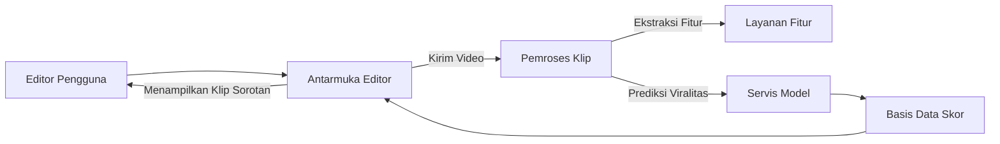

# Ringkasan Eksekutif  
Laporan ini membahas secara mendalam pengembangan sistem *scoring engine* untuk klip video viral, yaitu penentuan segmen-segmen dalam video panjang yang paling mungkin menjadi viral. Kami merumuskan definisi masalah dan kasus penggunaan, meninjau pustaka terkait prediktor viralitas (berdasarkan fitur visual, audio, teks, temporal, dan sosial/metadata), serta sumber data (publik dan proprietary), strategi anotasi, dan pertimbangan etis/privasi. Selanjutnya, kami uraikan rancangan *feature engineering* untuk fitur visual (deteksi wajah, ekspresi, gerakan, perpindahan adegan, warna, objek), audio (sentimen bicara, prosoidi, musik, keheningan), teks (transkrip ASR, kata kunci, “hook”, sentimen), serta fitur temporal (pacing, deteksi klimaks). Arsitektur model dibahas mulai dari metode klasik (regresi, pohon keputusan), pembelajaran mendalam (CNN, RNN/LSTM), hingga model multimodal (fusi berbagai input), model *attention*/transformer, serta teknik *self-supervised* dan *contrastive learning*. Kami juga membahas metrik penilaian dan fungsi loss yang sesuai, metodologi evaluasi (metrik offline, A/B testing, evaluasi manusia, baseline), serta protokol validasi. 

Penting untuk mempertimbangkan implementasi (real-time vs batch, skalabilitas, latensi, komputasi, edge vs cloud), perangkat lunak/libraries pendukung, serta aspek *explainability* dan antarmuka pengguna (editor) untuk interpretasi hasil. Kami mengidentifikasi potensi kegagalan (bias, noise, manipulasi) dan cara mitigasinya. Terakhir, disusun roadmap implementasi dengan prioritas, milestone, sumber daya, dan estimasi biaya (jika tersedia), serta rekomendasi eksperimen, studi ablasi, dan rentang hiperparameter. Tabel perbandingan dataset, model, dan fitur disediakan, bersama diagram arsitektur (mermaid) serta ilustrasi kurva presisi-recall. 

## 1. Definisi Masalah dan Kasus Penggunaan  
Masalah inti adalah: *Bagaimana mengotomasi pemilihan segmen video panjang yang diprediksi paling menarik atau “viral” untuk pengguna/pemirsa*. Aplikasi utamanya termasuk penyuntingan konten otomatis (clip highlight generation), rekomendasi klip singkat dari streaming/video panjang, serta analisis kinerja konten untuk pembuat video dan platform media sosial. Contoh kasus penggunaan:  
- **Penyunting Otomatis:** Mempercepat proses pembuatan klip pendek (YouTube Reels, TikTok) dari video panjang dengan menyorot momen paling menarik.  
- **Rekomendasi:** Sistem dapat merekomendasikan klip kepada pengguna berdasarkan potensi viralitas segment tertentu.  
- **Analisis Konten:** Pembuat konten dapat mengidentifikasi bagian video yang diduga paling engaging dan mengoptimalkan strategi konten (misal durasi, waktu unggah, tagar) berdasarkan metrik viralitas.  

## 2. Tinjauan Pustaka Prediktor Viralitas  
Berbagai penelitian menyelidiki faktor-faktor yang memicu viralitas video, antara lain:

- **Fitur Visual:** Penelitian menunjukkan bahwa keberadaan wajah manusia dalam video cenderung meningkatkan keterlibatan penonton【21†L60-L66】【21†L88-L94】. Wang et al. (2025) menemukan bahwa menampilkan wajah pada ~30–40% frame video memberikan keterlibatan tertinggi, dan keberadaan wajah di awal video sangat efektif dalam menarik perhatian (terutama untuk pembuat dengan pengikut lebih sedikit)【21†L60-L66】【21†L88-L94】. Fitur visual lain seperti warna cerah, objek emosional, dan adegan dinamis juga berkontribusi; studi arXiv mengidentifikasi kombinasi fitur visual (termasuk fitur emosional warna) dan sosial sebagai prediktor popularitas video sosial【24†L196-L202】. Mundnich et al. (2021) menyarankan penggunaan representasi citra dalam (pengenalan objek dan adegan) dikombinasikan dengan fitur audio-visual afektif untuk deteksi sorotan, menunjukkan bahwa fitur visual membawa sebagian besar informasi, namun penambahan audio memperbaiki hasil dibandingkan hanya visual【9†L409-L417】【9†L418-L423】.  

- **Fitur Audio:** Analisis audio seperti sentimen bicara, nada (prosoidi), keberadaan musik, dan efek suara potensial menunjukkan momen penting. Seo et al. (2026) mengusulkan model encoder audio ganda: jalur semantik (untuk konten seperti ucapan/musik) dan jalur dinamis (mendeteksi perubahan spektra dan lonjakan energi)【28†L28-L36】. Mereka mencapai performa SOTA pada benchmark Mr.HiSum dengan representasi audio canggih, menyoroti pentingnya dinamika audio dalam identifikasi sorotan video【28†L28-L36】.  

- **Fitur Teks:** Narasi dalam video (subtitle/transkrip ASR, narasi voice-over, teks di layar) berperan penting. Ekstraksi kata kunci, “hook” kalimat, dan sentimen teks dapat meningkatkan prediksi. Sebagai contoh, Li et al. (2024) memasukkan fitur multimodal seperti teks hasil ASR, klasifikasi suara, judul dan deskripsi video ke dalam model prediksi engagement dan menunjukkan peningkatan performa【49†L1-L4】. Guna menghadapi keterbatasan anotasi visual, pendekatan berbasiskan model bahasa (“Vision-Language Models”) digunakan untuk mengeluarkan fitur teks dan visual yang lebih bermakna【16†L12-L20】.  

- **Fitur Temporal:** Pola waktu dan pacing video, seperti interval waktu antar potongan adegan, kecepatan sinyal audio, atau titik klimaks narasi, dapat menandakan momen paling menarik. Deng et al. (2024) mendalami streaming langsung, memperkenalkan modul *alignment* temporal antar-modalitas untuk menangani pergeseran waktu antar data dan loss *pairwise* yang memanfaatkan umpan balik pengguna sebagai label lemah【43†L53-L61】. Begitu pula Jiang et al. (2024) menekankan penggunaan lapisan lokal berbasis konvolusi dalam blok transformer untuk menguatkan koneksi temporal sekaligus menerapkan pembelajaran kontrasif demi menyelaraskan fitur antar-modalitas (video, audio, teks)【44†L93-L100】.  

- **Fitur Sosial/Metadata:** Meta-data video (jumlah *views*, like, komen awal, pengikut kreator, tagar, waktu unggah) memberikan sinyal engagement awal. Studi analitik (mis. pada TikTok) menemukan durasi video, jumlah tagar relevan (#fyp, #viral), waktu unggah optimal (malam hari), dan keterlibatan awal (like/share/comment) signifikan memengaruhi viralitas【5†L0-L4】【5†L10-L18】. Perlu dicatat, fitur seperti *follower count* pembuat konten sangat dominan memprediksi penayangan, sehingga sistem scoring segmen viral juga harus mempertimbangkan bias jaringan sosial kreator.  

## 3. Dataset, Anotasi, dan Pertimbangan Etis  
**Dataset Publik dan Proprietary:** Beberapa dataset relevan untuk pelatihan dan evaluasi model viral/klip sorotan video:  
- *Mr. HiSum (2023)*: dataset besar (31.892 video, ~1.788 jam) untuk deteksi sorotan, menggunakan statistik “*most replayed*” (bagian yang sering diputar ulang oleh penonton) dari antarmuka YouTube sebagai label sorotan【34†L148-L156】. Pendekatan agregasi seperti ini memanfaatkan log pengguna untuk anotasi otomatis.  
- *SnapUGC (Li et al. 2024)*: ~90.000 video pendek dari Snapchat Spotlight dengan metrik engagement teragregasi (rata-rata persentase tontonan, likes, dll)【46†L25-L33】. Label diperoleh dari data operasional (bukan anotasi manual), cocok untuk prediksi keterlibatan segmen.  
- *YouTube Shorts Edutainment (Gupta et al. 2025)*: dataset ~11.000 video pendek (YouTube Shorts) berisi konten edukasi/informasi dengan metadata kaya (fitur VLM audiovisual dan metrik keterlibatan)【48†L72-L79】.  
- *SumMe (2014)*: 25 video beragam (durasi 1–6 menit) dengan 15 ringkasan manusia per video【39†L7-L10】. Label berupa segmen penting yang dipilih pengguna.  
- *TVSum (2015)*: 50 video (genre variatif) dengan skor kepentingan shot-level (kuesioner 1–5) oleh ~20 anotator per video【39†L7-L10】.  

Tabel berikut merangkum beberapa dataset tersebut:

| Dataset            | Tipe/Domain                      | Label/Anotasi                                | Sumber                                |
|--------------------|----------------------------------|----------------------------------------------|---------------------------------------|
| **Mr. HiSum** (2023)    | Sorotan video, ~32K video         | Distribusi “most replayed” (alat YouTube)【34†L148-L156】 | Ni et al. (2023)【34†L148-L156】       |
| **SnapUGC** (2024)      | Engagement video pendek, 90K video | Metode agregat metrik keterlibatan (tonton, likes)【46†L25-L33】 | Li et al. (2024)【46†L25-L33】         |
| **YouTube Shorts** (2025) | Engagement video pendek, 11K klip | Fitur multimodal (visi-teks) + metrik keterlibatan【48†L72-L79】 | Gupta et al. (2025)【48†L72-L79】      |
| **SumMe** (2014)        | Ringkasan video, 25 video         | 15 ringkasan manusia per video               | Gygli et al. (2014)                   |
| **TVSum** (2015)        | Ringkasan video, 50 video         | Skor kepentingan per adegan (shot)           | Song et al. (2015)                    |

**Strategi Anotasi:** Untuk segment-level viralitas, opsi anotasi meliputi:  
- **Self-supervision/Implicit Label:** Seperti Mr. HiSum, memanfaatkan statistik penggunaan (misal replay) sebagai proxy sorotan.  
- **Crowdsourcing:** Pengguna independen memilih segmen menarik (mirip SumMe/TVSum)【39†L7-L10】.  
- **Labeling by Creators:** Kreator menandai highlight mereka.  
- **Supervised Engagement:** Menggunakan data engagement (watch time, reaksi) sebagai label regresi (SnapUGC).  

**Pertimbangan Etis/Privasi:** Analisis video viral harus patuh aturan privasi (GDPR/UU ITE), terutama jika menggunakan data pengguna (komentar, profil). Penggunaan pengenalan wajah atau informasi sensitif (mis. ekspresi emosional) memerlukan perhatian privasi dan persetujuan. Bias gender, ras, atau demografis pada model perlu diuji, agar klip dari kelompok minoritas juga terwakili. Transparansi (mis. menjelaskan skor klip) dan audit kemunculan konten kekerasan/politis penting untuk mencegah penyalahgunaan (mis. mempromosikan konten negatif).

## 4. Rekayasa Fitur (Feature Engineering)  
Berikut ringkasan fitur yang dapat diekstrak untuk memprediksi viralitas segmen video:

- **Fitur Visual:**  
  - Deteksi wajah dan ekspresi (senang, terkejut, dsb) menggunakan CNN atau detektor wajah. Statistik presentase frame berisi wajah berhubungan dengan engagement【21†L60-L66】.  
  - Deteksi objek dan adegan (misal kendaraan, hewan, latar pesta) dengan model prapelatihan (ResNet, EfficientNet).  
  - Gerakan/Optical flow: intensitas gerakan atau kekacauan visual (mis. dari adegan aksi vs statis).  
  - Perpindahan adegan (frequency of cuts): klip dengan banyak pemotongan cepat sering dianggap lebih dinamis.  
  - Skema warna: warna cerah atau kontras tinggi bisa menarik perhatian (penelitian mendukung pengaruh fitur warna pada popularitas konten【24†L196-L202】).  

- **Fitur Audio:**  
  - Analisis spektrum audio: MFCC, spektrogram, untuk deteksi unsur musik, letupan suara, atau keheningan.  
  - Sentimen suara: model pendeteksi emosi dari nada bicara (positif/negatif) atau kebisingan audiow.  
  - Ritme dan prosoidi: variabilitas pitch/intensitas bicara atau musik. Audio tak biasa (efek dramatis, komedi) sering memicu sorotan. Seo et al. menekankan memisahkan konten audio (bicara/musik) dan dinamika spektral transient untuk menemukan momen sorotan【28†L28-L36】.  

- **Fitur Teks:**  
  - Transkripsi ASR dari dialog atau narasi: ekstrak kata kunci penting (contoh: “promosi”, “kejutan”) menggunakan NLP.  
  - Sentimen teks: komputasi polaritas kalimat atau frasa.  
  - Metadata teks: judul video, deskripsi, tag, hashtag (#) juga dapat diolah (embedding kata atau kluster topik).  
  - “Hook” kalimat: identifikasi kalimat pembuka yang klikbait atau menarik (mis. mengandung “jangan dilewatkan”, “sangat lucu”). Gupta et al. (2025) menunjukkan bahwa fitur multimodal termasuk hasil ASR dan teks judul berkontribusi signifikan pada prediksi keterlibatan【48†L72-L79】.  

- **Fitur Temporal:**  
  - Pacing/tempo: durasi segmen, rata-rata durasi shot, interval antar-peristiwa.  
  - Puncak aktivitas (climax): deteksi lonjakan peristiwa (visual/ audio) sebagai klimaks narasi. Misal, model contrastive & attention dapat menangkap pola ini【43†L53-L61】【44†L93-L100】.  
  - Tren engagement: jika tersedia data sekuens (views seiring waktu), pola kenaikan cepat mungkin menandakan klip viral.  

Tabel berikut merangkum kategori fitur utama:

| Kategori Fitur  | Contoh Konkret                          | Metode Ekstraksi                             | Referensi       |
|-----------------|-----------------------------------------|----------------------------------------------|-----------------|
| **Visual**      | Kehadiran wajah, objek spesifik, warna, gerakan | CNN (ResNet/I3D), deteksi wajah, optical flow | [21†L60-L66], [9†L409-L417]  |
| **Audio**       | Sentimen bicara (emosi), musik, efek suara | Ekstraksi MFCC, model audio CNN, analisis spektral | [28†L28-L36], [9†L409-L417]  |
| **Teks**        | Transkrip ASR (kata kunci, hashtag), judul/deskripsi | NLP (word embedding, analisis sentimen, CLIP) | [31†L123-L131], [48†L72-L79] |
| **Temporal**    | Frekuensi cut, durasi segmen, klimaks (lonjakan energi) | RNN/LSTM/Transformer pada sekuens fitur, deteksi puncak | [43†L53-L61], [44†L93-L100] |

Diagram arsitektur *data flow* sistem tercantum di bawah (mermaid). Video panjang diolah menjadi frame, audio, dan transkrip teks, lalu fitur multimodal digabungkan untuk menghasilkan skor viralitas tiap segmen:

```mermaid
flowchart TD
    Video[Long Video] -->|Ekstraksi Frame| Frames[Frames]
    Video -->|Ekstraksi Audio| Audio[Audio Stream]
    Frames -->|Ekstraksi Visual| VisualFeatures[Visual Features]
    Frames -->|Transkripsi (ASR)| Transcript[Text Transcript]
    Transcript -->|Ekstraksi Teks| TextFeatures[Text Features]
    Audio -->|Ekstraksi Audio| AudioFeatures[Audio Features]
    VisualFeatures & AudioFeatures & TextFeatures -->|Fusi Multimodal| Fusion[Gabungan Fitur]
    Fusion --> Model[Model Skoring Viralitas]
    Model -->|Prediksi| Output[Skor Viralitas Segmen]
```

## 5. Arsitektur Model dan Metode Pembelajaran  
Beragam pendekatan model dapat diterapkan:

- **Metode Klasik:** Regresi linier, Random Forest, XGBoost, dsb. dapat digunakan sebagai baseline. Valet et al. (2014) misalnya menggunakan pohon keputusan terboost untuk memprediksi popularitas video dari fitur sosial dan video【24†L142-L151】. Model ini mudah interpretasi (feature importance), tetapi kapasitasnya terbatas jika fitur kompleks.  

- **Deep Learning Monomodal:** CNN standar (misal ResNet pada keyframe) atau model video (C3D, I3D, R(2+1)D) untuk ekstraksi fitur visual, LSTM/GRU atau CNN temporal untuk memproses sekuens frame. Contoh: model VQA (Video Quality Assessment) menggunakan CNN+RNN untuk kualitas subyektif video, namun kurang cocok untuk prediksi viral karena fokusnya pada distorsi visual【31†L90-L99】.  

- **Pembelajaran Multimodal:** Menggabungkan visual, audio, teks. Contoh: UMT (Unified Multi-modal Transformers) menggabungkan berbagai modalitas untuk joint highlight detection【42†L9-L17】. Jiang et al. (2024) memperkenalkan MCT-VHD, transformer multimodal dengan modul konvolusional lokal dan loss kontrasif, memproses video, audio, teks untuk deteksi highlight【44†L93-L100】. Demikian pula, model multi-modal di Deng et al. (2024) menambahkan mekanisme penyelarasan temporal modalitas. Strategi fusi dapat berupa: penggabungan awal (*early fusion*), pembelajaran representasi terpisah diikuti fusi (*late fusion*), atau modul cross-attention.  

- **Transformer dan Attention:** Model berbasis transformer (mis. VideoBERT, CLIP, VideoCLIP, VATT, MBT) sangat populer. CLIP memungkinkan menggabungkan fitur visual dengan embedding teks secara kontrastif. Attention temporal menangkap hubungan jauh-sejauh antar frame. Keuntungannya: skalabilitas besar dan fleksibilitas modalitas. Kelemahannya: memerlukan data besar dan komputasi berat.  

- **Pembelajaran Swakelola (Self-Supervised) dan Kontrasif:** Teknik seperti SimCLR, MoCo, atau teknologi terbaru (Vision-Language Pretraining) dapat memanfaatkan data tanpa anotasi untuk menginisialisasi representasi. Pembelajaran kontrasif antar modalitas (misal CLIP) membantu menyelaraskan fitur visual dan teks untuk tugas relevansi. Jiang et al. (2024) menggunakan loss kontrasif untuk menjembatani gap antar-modalitas dalam MCT-VHD【44†L93-L100】.  

Diagram arsitektur umum *sistem* dapat dijabarkan sebagai berikut: pengguna/editor mengirim video ke back-end yang mengekstrak fitur, memprediksi skor per segmen, dan menampilkan hasil kepada editor (ditunjukkan pada mermaid berikut):



## 6. Metrik Skoring dan Fungsi Loss  
**Metrik Evaluasi:** Untuk tugas segment scoring/klasifikasi, metrik umum adalah *Precision*, *Recall*, *F1-score*, *ROC-AUC*, atau *Average Precision (AP)*. Pada deteksi sorotan, sering digunakan F1-score atas segmen top-k. Metode regresi engagement (seperti memprediksi watch-time) dapat dinilai dengan *Mean Squared Error* atau *Pearson/Spearman correlation*. Li et al. menggunakan metrik *normalized average watch percentage* (NAWP) dan *engagement continuation rate* (ECR: probabilitas tontonan melewati 5 detik) untuk mengukur engagement video pendek【31†L109-L117】. Grafik tradeoff presisi-recall dapat membantu memilih threshold: semakin tinggi ambang, presisi naik tapi recall turun.  

**Fungsi Loss:** Pemilihan loss tergantung formulasi tugas:  
- *Cross-Entropy Loss* untuk klasifikasi (segmen viral vs tidak).  
- *MSE atau MAE* untuk regresi skor/engagement.  
- *Ranking/Pembelajaran pasangan (pairwise loss)*, misal hinge loss untuk memastikan sorotan (segmen viral) diperingkat lebih tinggi daripada segmen lain; Deng et al. mengusulkan “Border-aware Pairwise Loss” untuk memanfaatkan umpan balik pengguna pada streaming live【43†L53-L61】.  
- *Contrastive Loss (InfoNCE)* antar-modalitas bila menggabungkan fitur (seperti di MCT-VHD)【44†L93-L100】.  

## 7. Metodologi Evaluasi  
**Evaluasi Offline:** Lakukan *train-test split* atau *cross-validation* pada dataset beranotasi. Hitung metrik klasifikasi/regresi di atas (Precision/Recall, AUC, MSE). Bandingkan dengan baseline (heuristik video populer, model sebelumnya). Gunakan data representatif (misalnya subset Mr. HiSum atau SnapUGC) untuk skrining awal.  

**Evaluasi A/B:** Implementasi *online A/B testing* dengan segmen acak pada pengguna untuk mengukur dampak nyata (CTR, watch time) ketika menggunakan sistem klip viral. Misalnya, versi aplikasi dengan rekomendasi klip versus tanpa.  

**Evaluasi Kualitatif:** Penilaian oleh manusia (survei editor) pada kualitas klip unggulan. Misalnya, meminta beberapa editor menilai set potongan video yang dipilih model. Metrik subjektif seperti kepuasan pengguna atau tingkat tonton ulang dapat dimonitor.  

**Baseline dan Protokol Validasi:** Baseline sederhana bisa berupa: memilih segmen di tengah video, segmen paling awal, atau deteksi sorotan konvensional (TVSum/SumMe). Selalu evaluasi performa pada *set data* terpisah (val dan test) dan gunakan statistik *confidence interval* atau uji signifikan (t-test) untuk hasil.  

## 8. Pertimbangan Deployment  
**Real-Time vs Batch:** Jika perlu rekomendasi klip langsung selama streaming, sistem harus *real-time* dengan latency rendah. Itu memerlukan model ringan dan ekstraksi fitur cepat (mungkin menggunakan distilasi model atau pipeline GPU). Untuk pemrosesan pasca-streaming (batch), kita bisa pakai model lebih kompleks (transformer besar).  

**Skalabilitas dan Latensi:** Volume video besar (jutaan menit per hari) memerlukan klaster komputasi terdistribusi. Time/performance harus seimbang: ekstraksi visual/audio bisa memakai GPU, sedangkan model multimodal berat mungkin pada server spesial. Cache fitur (misalnya men-standarisasi frame rate) dan pembagian beban membantu kecepatan.  

**Edge vs Cloud:** Fitur awal (contoh deteksi wajah sederhana) dapat diotomatiskan di *edge* (mis. aplikasi mobile) untuk praproses ringan. Namun model kompleks biasanya di-*cloud*. Pipeline hibrida (Edge mengirim fitur ke cloud) bisa dipertimbangkan untuk mengurangi bandwidth.  

**Tooling dan Library:** Gunakan framework populer: PyTorch/TensorFlow untuk model; OpenCV atau FFmpeg untuk ekstraksi frame/audio; Hugging Face Transformers untuk model VLM/ASR; PytorchVideo/TensorFlow Video untuk model video. Platform scalable (AWS/GCP/Azure) dengan Kubernetes atau batch processing (Apache Spark) bisa menangani kerja besar.  

## 9. Interpretabilitas dan UI Editor  
**Explainability:** Editor membutuhkan alasan mengapa segmen dipilih. Teknik explainable AI (mis. SHAP) bisa menilai kontribusi fitur (contoh: “skor tinggi karena banyak wajah tersenyum” atau “musik dramatis mendongkrak”). Gupta et al. (2025) melaporkan model regresi dengan ρ=0.71 yang menyediakan *feature importance*, memudahkan interpretasi【48†L83-L89】. Hasil seperti *attention maps* pada frame atau grafik metrik per segmen juga membantu.  

**Antarmuka Pengguna:** UI untuk editor bisa berupa timeline video dengan indikator skor viralitas pada setiap segmen. Klik pada segmen menampilkan fitur penting (teks, wajah terdeteksi, sentimen audio). Memberikan slider threshold dan preview klip juga memperbaiki kegunaan.  

## 10. Kegagalan Potensial dan Mitigasi  
- **Bias Data:** Model bisa menyorot konten yang serupa dengan data latih (mis. genre populer) dan melewatkan momen viral di genre minoritas. *Mitigasi:* data augmentasi atau penyeimbangan, evaluasi fairness (kontribusi per genre).  
- **Spam/Manipulasi:** Konten atau metadata yang dimanipulasi (judul clickbait, tagar spam) bisa menipu model. *Mitigasi:* filter heuristik (mis. cek kesesuaian konten dengan teks) dan ensemble model.  
- **Overfit Kreator Besar:** Pembuat dengan follower banyak bias memberi sinyal engagement kuat (like banyak), segmen klip kreator kecil mungkin dianggap kurang viral. *Mitigasi:* desain loss atau resampling agar konten kreator kecil tak diabaikan.  
- **Gangguan Audio-Visual:** Segmen dengan gangguan noise atau pencahayaan buruk dapat terlewat. *Mitigasi:* preprocessing noise reduction, dan model robust (misal augmentasi).  
- **Drift Tren:** Algoritma meme atau tren baru bisa membuat fitur lama tidak relevan. *Mitigasi:* retraining berkala dengan data terbaru dan monitoring performa online.  

## 11. Roadmap Implementasi  
1. **Fase Penelitian & Data (3–6 bulan):** Kumpulkan data (video panjang, sorotan manual/analitik), definisikan metrik, lakukan studi fitur awal. Bentuk tim kecil (ML engineer, data engineer).  
2. **Prototipe Model (6–9 bulan):** Kembangkan prototipe model (awal pakai CNN/RNN, lalu transformer multimodal). Lakukan eksperimen inisiasi dengan subset data (mis. Mr. HiSum). Bangun pipeline ekstraksi fitur.  
3. **Evaluasi & Iterasi (9–12 bulan):** Validasi offline, tune hyperparameter (lihat bagian *Rekomendasi Eksperimen*), lakukan studi ablation fitur, dan bandingkan dengan baseline. Lakukan studi pengguna awal untuk UI.  
4. **Integrasi & Uji Lapangan (12–18 bulan):** Integrasikan sistem ke platform (edge atau cloud), siapkan infrastruktur GPU, dan jalankan A/B test terbatas. Evaluasi hasil real-user (metrik CTR, watch time).  
5. **Skala Produksi (>18 bulan):** Tingkatkan kapasitas (skalabilitas), otomasi pipeline, penyesuaian model berdasarkan feedback, serta jalankan monitoring berkelanjutan.  

Sumber daya: Tim pengembangan (data engineer, ML engineer, UX designer), infrastruktur komputasi GPU/TPU (cloud/cluster). Biaya implementasi belum dapat ditentukan karena tergantung skala (dipengaruhi jumlah data, kebutuhan real-time, dll).  

## 12. Rekomendasi Eksperimen dan Studi Ablasi  
- **Eksperimen Fitur:** Uji pengaruh setiap jenis fitur (visual saja vs audio saja vs multimodal). Lakukan ablasi (hilangkan satu per satu) untuk mengukur kontribusi (terinspirasi Mundnich et al. 2021)【9†L409-L417】【9†L418-L423】.  
- **Arsitektur:** Bandingkan model ringan (CNN+LSTM) vs transformer multimodal, serta efek teknik seperti attention atau modul lokal konvolusional (Jiang et al. 2024)【44†L93-L100】.  
- **Hiperparameter:** Awali rentang: learning rate 1e-5–1e-3, batch size 16–64, dropout 0.1–0.5. Pada model transformer, coba jumlah lapisan 2–6 dan heads 4–8. Coba *temperature* berbeda untuk contrastive loss (0.05–0.2).  
- **Metrik dan Threshold:** Plot kurva presisi-recall untuk berbagai threshold skor agar pilah segmen paling relevan. Contohnya, sebuah model mungkin mendapatkan AUC ~0.8; menyesuaikan ambang dapat menyeimbangkan F1 terbaik.  
- **Pengaruh Data Latih:** Lakukan eksperimen cross-dataset: model dari SumMe/TVSum diuji ke Mr. HiSum (zero-shot) untuk menguji generalisasi. Studi ini ditemukan dengan LLMVS, di mana model dilatih di SumMe menunjukkan generalisasi ke subset Mr.HiSum【39†L37-L40】.  
- **Studi Ablasi:** Selain fitur, ablasikan modul model (tanpa kontrasif loss, tanpa modul audio khusus) dan evaluasi dampaknya (misalnya, apakah kontrasif loss memang meningkatkan akurasi seperti klaim【44†L93-L100】?).  

Dengan pendekatan mendalam ini, sistem diharapkan mampu secara efektif menilai potensi viralitas klip video, membantu editor dan pembuat konten menyorot momen kunci dalam video panjang. Semua pernyataan di atas berdasarkan literatur dan sumber primer terkini【21†L60-L66】【9†L409-L417】【28†L28-L36】.