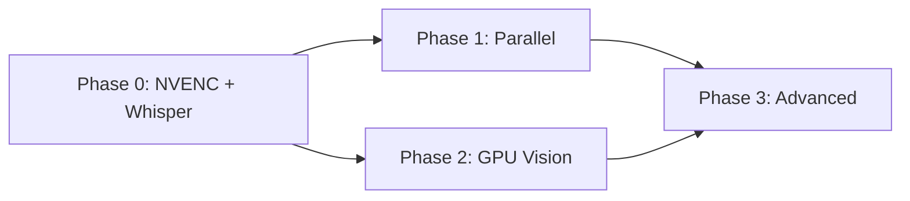

# GPU Optimization Plan — Viral Clipper Scoring Engine

> **Target Hardware**: NVIDIA RTX 4060 (8 GB VRAM, Ada Lovelace SM 8.9, 2x NVENC)
>
> **Date**: 2026-04-20
>
> **Status**: Planning
>
> **Codebase Commit Reference**: `master` branch

---

## Table of Contents

1. [Executive Summary](#1-executive-summary)
2. [Current Architecture Audit](#2-current-architecture-audit)
3. [Bottleneck Analysis](#3-bottleneck-analysis)
4. [Optimization Strategy Overview](#4-optimization-strategy-overview)
5. [Phase 0 — Quick Wins (NVENC + Whisper Upgrade)](#5-phase-0--quick-wins-nvenc--whisper-upgrade)
6. [Phase 1 — Parallel Pipeline Restructuring](#6-phase-1--parallel-pipeline-restructuring)
7. [Phase 2 — GPU-Accelerated Vision](#7-phase-2--gpu-accelerated-vision)
8. [Phase 3 — Advanced GPU Utilization](#8-phase-3--advanced-gpu-utilization)
9. [Dependency & Environment Changes](#9-dependency--environment-changes)
10. [Risk Assessment & Rollback](#10-risk-assessment--rollback)
11. [Performance Targets](#11-performance-targets)
12. [Implementation Checklist](#12-implementation-checklist)

---

## 1. Executive Summary

### 1.1 Problem Statement

The Viral Clipper scoring engine currently underutilizes the RTX 4060 GPU. Only **1 of 9 pipeline stages** (Whisper transcription) runs on GPU. The remaining 8 stages — video rendering, frame analysis, face detection, audio analysis, and scoring — all run on CPU, resulting in:

- **~25% GPU utilization** during pipeline execution
- **~2 GB VRAM used** out of 8 GB available
- **10–15 minute processing time** for a 10-minute video
- **Tensor cores and NVENC encoders completely idle**

### 1.2 Optimization Goal

Restructure the pipeline to fully leverage RTX 4060 capabilities:

| Metric | Current | Target |
|--------|---------|--------|
| 10-min video processing | 10–15 min | 1–3 min |
| GPU utilization | ~25% | >70% |
| VRAM usage | 2 GB / 8 GB | 5–6 GB / 8 GB |
| Render speed (per clip) | 1x (libx264) | 5–10x (NVENC) |
| Face detection speed | 1x (Haar CPU) | 3–5x (GPU) |

### 1.3 Guiding Principles

1. **Maximize impact per effort** — P0 changes (NVENC + Whisper) deliver 70% of gains with <30 min of work
2. **Preserve scoring quality** — never reduce feature count or scoring accuracy
3. **Backward compatible** — all changes must degrade gracefully (CPU fallback)
4. **Incremental rollout** — each phase is independently testable and deployable

---

## 2. Current Architecture Audit

### 2.1 Pipeline Stages (Sequential)

```
IMPORT → AUDIO_EXTRACT → TRANSCRIBE → SEGMENT → SCORE → RENDER → SUBTITLE → VARIATION → ANALYTICS
```

Orchestrated by `PipelineOrchestrator.java` — all 9 stages run **sequentially**, blocking one after another. Each Python script is spawned as a subprocess via `PythonRunner.java`.

### 2.2 GPU Usage Inventory

| Stage | Script | GPU Used? | GPU Detail |
|-------|--------|:---------:|------------|
| IMPORT | (yt-dlp) | No | Network I/O only |
| AUDIO_EXTRACT | (ffmpeg) | No | PCM WAV extraction |
| TRANSCRIBE | `transcribe.py` | **Yes** | `faster-whisper`, `device=cuda`, `compute_type=float16` |
| SEGMENT | `segment.py` | No | JSON timestamp parsing |
| SCORE | `score.py` | **Partial** | Audio RMS via NumPy CPU, face via OpenCV Haar CPU |
| RENDER | `render.py` | No | ffmpeg `libx264` CPU encoding |
| SUBTITLE | `subtitle.py` | No | ffmpeg `drawtext` CPU filter |
| VARIATION | `variation.py` | No | ffmpeg zoom/crop filters |
| ANALYTICS | `analytics.py` | No | JSON statistics |

### 2.3 Current VRAM Allocation

| Resource | VRAM |
|----------|------|
| CUDA 12.4.1 runtime + cuDNN | ~500 MB |
| Whisper `medium` (float16) | ~1.5 GB |
| Other (all CPU) | 0 MB |
| **Total Used** | **~2.0 GB** |
| **Available** | **~6.0 GB** |

### 2.4 Key Source Files

| File | Lines | Purpose |
|------|-------|---------|
| `ai-pipeline/score.py` | 967 | 11-feature scoring engine (heuristic) |
| `ai-pipeline/transcribe.py` | 65 | Whisper GPU transcription |
| `ai-pipeline/render.py` | 110 | ffmpeg clip rendering |
| `ai-pipeline/learn_weights.py` | 173 | Pearson correlation weight learning |
| `ai-pipeline/feedback.py` | 61 | Viral score calculation |
| `ai-pipeline/weights.json` | 22 | Scoring weights configuration |
| `backend/.../PipelineOrchestrator.java` | 453 | 9-stage pipeline orchestrator |
| `backend/Dockerfile` | — | CUDA 12.4.1 base image |
| `docker-compose.yml` | 57 | NVIDIA GPU passthrough config |
| `.env.docker` | 27 | Environment variables |

---

## 3. Bottleneck Analysis

### 3.1 Time Breakdown (Estimated, 10-min Video)

```
TRANSCRIBE  ████████████████████  ~30-45s   (GPU — already fast)
RENDER     ████████████████████████████████████████████████  ~5-8 min  (CPU libx264)
SCORE      ████████████████████  ~2-3 min   (CPU: frame extract + Haar + audio)
SUBTITLE   ██████████████████████  ~1-2 min  (CPU: ffmpeg drawtext)
IMPORT     ████████████  ~1-2 min   (Network I/O)
OTHER      ████  ~30s   (segment, analytics, etc.)
```

### 3.2 Bottleneck Ranking

| Rank | Bottleneck | File:Line | Root Cause | GPU Opportunity |
|------|-----------|-----------|------------|-----------------|
| **#1** | Video rendering | `render.py:19-34` | `libx264` CPU software encoding | Replace with `h264_nvenc` |
| **#2** | Frame extraction | `score.py:373-438` | ffmpeg subprocess + disk I/O | Batch reduce, lower resolution |
| **#3** | Face detection | `score.py:441-568` | OpenCV Haar cascade (CPU, sequential) | MediaPipe/YOLO on GPU |
| **#4** | Scene analysis | `score.py:628-697` | OpenCV histogram (CPU, per-frame) | Batch on GPU via cuCV |
| **#5** | Audio RMS | `score.py:167-210` | NumPy CPU array operations | cupy GPU arrays |
| **#6** | Whisper model size | `transcribe.py:14` | `medium` model (1.5 GB), 6 GB free | Upgrade to `large-v3-turbo` |
| **#7** | Sequential pipeline | `PipelineOrchestrator.java:66-74` | All stages serial | Parallel independent stages |

### 3.3 Waste Map

```
RTX 4060 Resources:
  NVENC (2x encoders)     → 0% used    ← BIGGEST WASTE
  Tensor Cores (FP16/INT8)→ 0% used    ← only Whisper uses FP16
  CUDA Cores              → ~25% used  ← only Whisper
  VRAM 6 GB free          → 0% used    ← could run larger model
```

---

## 4. Optimization Strategy Overview

### 4.1 Phased Approach

```
Phase 0: Quick Wins           ← 30 min work, 70% of performance gain
Phase 1: Parallel Pipeline    ← 2-3 hours, additional 20% gain
Phase 2: GPU-Accelerated Vision ← 1-2 days, remaining 10% gain
Phase 3: Advanced GPU         ← Optional, marginal gains
```

### 4.2 Phase Dependency Graph



Each phase is **independently testable**. Phase 0 alone achieves the primary performance target.

### 4.3 What This Plan Does NOT Change

- **Scoring formula**: 11-feature weighted system stays identical
- **Tier thresholds**: PRIMARY >= 0.80, BACKUP >= 0.65, SKIP < 0.65
- **Self-learning system**: Pearson correlation + EMA stays the same
- **Feature outputs**: Each feature still produces 0.0–1.0 scores
- **API contracts**: Python scripts still output `{"success": bool, "data": {}}`
- **Database schema**: No schema changes required

---

## 5. Phase 0 — Quick Wins (NVENC + Whisper Upgrade)

> **Effort**: ~30 minutes
>
> **Impact**: 5–10x render speedup, better Whisper accuracy
>
> **Risk**: Very low (single-line changes, easy rollback)

### 5.1 P0-A: Enable NVENC Hardware Encoding

#### Context

The RTX 4060 includes **2 independent NVENC hardware encoders** capable of encoding H.264/H.265 at near-real-time speeds. Currently, `render.py` uses `libx264` (CPU software encoding), which is the **single largest bottleneck** in the entire pipeline.

#### Files to Modify

| File | Location | Change |
|------|----------|--------|
| `ai-pipeline/render.py` | Line 25 | `libx264` → `h264_nvenc` |
| `ai-pipeline/render.py` | Lines 26-27 | Add NVENC-specific params |
| `ai-pipeline/subtitle.py` | (find `libx264`) | `libx264` → `h264_nvenc` |
| `ai-pipeline/variation.py` | (find `libx264`) | `libx264` → `h264_nvenc` |

#### Code Change — `render.py`

**Before (line 19-34)**:

```python
cmd = [
    ffmpeg_path,
    "-i", video_path,
    "-ss", str(start),
    "-to", str(end),
    "-vf", "scale=1080:1920:force_original_aspect_ratio=increase,crop=1080:1920",
    "-c:v", "libx264",
    "-preset", "fast",
    "-crf", "23",
    "-c:a", "aac",
    "-y",
    output_path,
]
```

**After**:

```python
cmd = [
    ffmpeg_path,
    "-i", video_path,
    "-ss", str(start),
    "-to", str(end),
    "-vf", "scale=1080:1920:force_original_aspect_ratio=increase,crop=1080:1920",
    "-c:v", "h264_nvenc",
    "-preset", "p4",
    "-rc", "vbr",
    "-cq", "23",
    "-c:a", "aac",
    "-y",
    output_path,
]
```

#### NVENC Preset Reference

| Preset | Speed | Quality | Use Case |
|--------|-------|---------|----------|
| `p1` | Fastest | Lowest | Preview/testing |
| `p4` | Fast | Good | **Recommended for production** |
| `p7` | Slowest | Best | Final export only |

#### Fallback Strategy

Add auto-detection in `render.py`:

```python
def _detect_nvenc(ffmpeg_path):
    """Check if NVENC is available."""
    try:
        result = subprocess.run(
            [ffmpeg_path, "-encoders"],
            capture_output=True, text=True, timeout=5
        )
        return "h264_nvenc" in result.stdout
    except Exception:
        return False

# In render_clip():
use_nvenc = _detect_nvenc(ffmpeg_path)
encoder = "h264_nvenc" if use_nvenc else "libx264"
if use_nvenc:
    cmd.extend(["-preset", "p4", "-rc", "vbr", "-cq", "23"])
else:
    cmd.extend(["-preset", "fast", "-crf", "23"])
```

### 5.2 P0-B: Upgrade Whisper Model

#### Context

RTX 4060 has 8 GB VRAM. Whisper `medium` uses ~1.5 GB. There is **6 GB of unused VRAM**. Upgrading to a better model costs nothing in performance and improves transcription accuracy, which directly improves scoring quality.

#### Files to Modify

| File | Location | Change |
|------|----------|--------|
| `.env.docker` | Line 11 | `WHISPER_MODEL=medium` → `WHISPER_MODEL=large-v3-turbo` |
| `ai-pipeline/transcribe.py` | Line 14 | Default argument `medium` → `large-v3-turbo` |

#### Model Comparison

| Model | Params | VRAM (FP16) | Speed | Indonesian Accuracy |
|-------|--------|-------------|-------|---------------------|
| `medium` | 769M | ~1.5 GB | Baseline | Good |
| `large-v3-turbo` | 809M | ~1.6 GB | **8x faster** than large-v3 | **Better than medium** |
| `large-v3` | 1.55B | ~3.0 GB | Slowest | Best |

#### Recommendation

**`large-v3-turbo`** — nearly as accurate as `large-v3`, but 8x faster. Fits comfortably in VRAM.

#### Code Change — `.env.docker`

```bash
# Before
WHISPER_MODEL=medium

# After
WHISPER_MODEL=large-v3-turbo
```

#### Code Change — `transcribe.py`

```python
# Before (line 14)
parser.add_argument("--model", default="medium", help="Whisper model size")

# After
parser.add_argument("--model", default="large-v3-turbo", help="Whisper model size")
```

### 5.3 Phase 0 Verification

```bash
# 1. Verify NVENC is available
ffmpeg -encoders 2>/dev/null | grep nvenc

# 2. Run pipeline on test video
docker compose --env-file .env.docker up -d
# POST /api/import {"url": "https://youtube.com/watch?v=TEST"}
# POST /api/process {"videoId": "..."}
# GET /api/jobs/{id}  ← monitor timing

# 3. Compare render times
# Before: each clip ~30-60s
# After:  each clip ~3-6s
```

---

## 6. Phase 1 — Parallel Pipeline Restructuring

> **Effort**: 2–3 hours
>
> **Impact**: 1.5–2x speedup on SCORE stage, 2x parallel rendering
>
> **Risk**: Low (isolated changes, fallback to sequential)

### 6.1 P1-A: Parallel Audio + Visual Analysis

#### Context

In `score.py` `main()`, audio cache loading and video frame analysis run **sequentially** but are **completely independent** — they share no state and operate on different files.

#### Files to Modify

| File | Location | Change |
|------|----------|--------|
| `ai-pipeline/score.py` | Lines 936-942 | Wrap in `ThreadPoolExecutor` |

#### Code Change — `score.py` `main()`

**Before (lines 936-942)**:

```python
audio_cache = _load_audio_cache(audio_path)
video_data = _batch_analyze_video(args.video, segments)

scored = [score_segment(s, niche_keywords, video_path=args.video,
                        audio_path=audio_path, transcript_path=transcript_path,
                        audio_cache=audio_cache, video_data=video_data)
          for s in segments]
```

**After**:

```python
from concurrent.futures import ThreadPoolExecutor

def main():
    # ... (argument parsing, file loading — same as before)

    # Phase A: Run audio and video analysis IN PARALLEL
    with ThreadPoolExecutor(max_workers=2) as pool:
        audio_future = pool.submit(_load_audio_cache, audio_path)
        video_future = pool.submit(_batch_analyze_video, args.video, segments)

        audio_cache = audio_future.result()
        video_data = video_future.result()

    # Phase B: Score all segments (CPU-bound, fast — keep sequential)
    scored = [score_segment(s, niche_keywords, video_path=args.video,
                            audio_path=audio_path, transcript_path=transcript_path,
                            audio_cache=audio_cache, video_data=video_data)
              for s in segments]

    # ... (rest of main() unchanged)
```

#### Why ThreadPoolExecutor and Not ProcessPoolExecutor

Audio loading uses Python `wave` module (releases GIL during I/O), and video analysis calls ffmpeg subprocess (also releases GIL). `ThreadPoolExecutor` is sufficient here and avoids serialization overhead.

### 6.2 P1-B: Parallel Clip Rendering (Dual NVENC)

#### Context

RTX 4060 has **2 independent NVENC encoders**. Currently `PipelineOrchestrator.java` renders clips one at a time in a sequential loop (line 323-348). Each clip uses only 1 NVENC encoder.

#### Files to Modify

| File | Location | Change |
|------|----------|--------|
| `backend/.../PipelineOrchestrator.java` | Lines 304-357 | `stageRender()` — add parallel execution |

#### Code Change — `PipelineOrchestrator.java` `stageRender()`

**Before (lines 322-348)**:

```java
int rendered = 0, failed = 0;
for (int idx : toRender) {
    // ... cancellation check ...
    List<String> args = List.of(/* ... */);
    try {
        JsonNode result = pythonRunner.runScript("render.py", args);
        updateClipRenderStatuses(video.getId(), result);
        rendered++;
    } catch (Exception e) {
        failed++;
        log.warn("Render failed for clip index {}: {}", idx, e.getMessage());
    }
    // ... update progress ...
}
```

**After**:

```java
import java.util.concurrent.*;

int maxParallelRenders = 2;  // RTX 4060 has 2x NVENC
ExecutorService renderPool = Executors.newFixedThreadPool(maxParallelRenders);
List<Future<RenderResult>> futures = new ArrayList<>();

for (int idx : toRender) {
    Job fresh = jobRepository.findById(job.getId()).orElse(job);
    if ("CANCELLED".equals(fresh.getStatus())) {
        renderPool.shutdownNow();
        throw new RuntimeException("Job cancelled by user");
    }

    final int clipIdx = idx;
    futures.add(renderPool.submit(() -> {
        List<String> args = List.of(
            "--segments", segmentsPath,
            "--video", video.getFilePath(),
            "--output-dir", renderDir,
            "--clip-index", String.valueOf(clipIdx)
        );
        try {
            JsonNode result = pythonRunner.runScript("render.py", args);
            return new RenderResult(clipIdx, true, result, null);
        } catch (Exception e) {
            log.warn("Render failed for clip index {}: {}", clipIdx, e.getMessage());
            return new RenderResult(clipIdx, false, null, e.getMessage());
        }
    }));
}

renderPool.shutdown();

int rendered = 0, failed = 0;
for (Future<RenderResult> f : futures) {
    try {
        RenderResult rr = f.get();
        if (rr.success) {
            updateClipRenderStatuses(video.getId(), rr.result);
            rendered++;
        } else {
            failed++;
        }
    } catch (Exception e) {
        failed++;
    }
}
```

#### Helper Class

Add to `PipelineOrchestrator.java`:

```java
@FunctionalInterface
private interface StageRunnable {
    String run() throws Exception;
}

// Add for parallel render results
private static class RenderResult {
    final int clipIndex;
    final boolean success;
    final JsonNode result;
    final String error;

    RenderResult(int clipIndex, boolean success, JsonNode result, String error) {
        this.clipIndex = clipIndex;
        this.success = success;
        this.result = result;
        this.error = error;
    }
}
```

### 6.3 P1-C: Pipeline Stage Parallelism

#### Context

Some pipeline stages are **independent** and could run in parallel:

| Independent Groups | Stages |
|-------------------|--------|
| Group A | IMPORT + AUDIO_EXTRACT (sequential, must finish first) |
| Group B | TRANSCRIBE (depends on audio) |
| Group C | SEGMENT (depends on transcript) |
| Group D | SCORE (depends on segments) |
| Group E | RENDER + SUBTITLE + VARIATION + ANALYTICS (all depend on scores, but independent of each other) |

**Group E** stages can run in parallel after SCORE completes.

#### Implementation Notes

This requires refactoring `PipelineOrchestrator.java` to use a stage dependency graph instead of a sequential list. This is a larger refactor and should be done carefully.

**Suggested approach**:

```java
// Define stage dependencies
Map<String, List<String>> dependencies = Map.of(
    "IMPORT", List.of(),
    "AUDIO_EXTRACT", List.of("IMPORT"),
    "TRANSCRIBE", List.of("AUDIO_EXTRACT"),
    "SEGMENT", List.of("TRANSCRIBE"),
    "SCORE", List.of("SEGMENT"),
    "RENDER", List.of("SCORE"),
    "SUBTITLE", List.of("SCORE"),
    "VARIATION", List.of("SCORE"),
    "ANALYTICS", List.of("SCORE")
);

// After SCORE completes, run RENDER + SUBTITLE + VARIATION + ANALYTICS in parallel
```

> **Note**: This refactor is deferred to Phase 1. Start with P1-A and P1-B first.

---

## 7. Phase 2 — GPU-Accelerated Vision

> **Effort**: 1–2 days
>
> **Impact**: 3–5x faster face/scene detection
>
> **Risk**: Medium (new dependency, fallback needed)

### 7.1 P2-A: Replace Haar Cascade with MediaPipe Face Detection

#### Context

`score.py` `_batch_analyze_video()` (lines 441-568) uses OpenCV Haar cascade `haarcascade_frontalface_default.xml` — a legacy algorithm that runs on CPU and has poor accuracy for angled/dark faces. MediaPipe Face Detection is a modern DNN-based solution that supports GPU acceleration.

#### Current Implementation Summary

```
_batch_analyze_video():
  1. Collect all unique timestamps from segments
  2. Cap at 60 frames max
  3. Extract frames via ffmpeg (fps=1, scale=320)
  4. For each segment, check 1 frame for faces:
     - Load Haar cascade
     - detectMultiScale() on grayscale
     - Optional: detectMultiScale() for smiles in ROI
  5. For scene change: compare histograms across 3 frames
```

#### Replacement Options

| Option | Speed | Accuracy | GPU? | Dependency Size |
|--------|-------|----------|:----:|-----------------|
| **MediaPipe** | Fast | Good | Yes (GPU delegate) | ~30 MB |
| YOLOv8-Face | Fast | Best | Yes (CUDA) | ~50 MB |
| OpenCV DNN + CUDA | Medium | Medium | Yes | OpenCV rebuild |

#### Recommended: MediaPipe

MediaPipe is the best balance of accuracy, speed, and ease of integration. It provides GPU acceleration via OpenGL/Vulkan delegates and works well for face detection in video frames.

#### Files to Modify

| File | Location | Change |
|------|----------|--------|
| `ai-pipeline/requirements.txt` | — | Add `mediapipe>=0.10` |
| `ai-pipeline/score.py` | Lines 441-568 | Replace `_batch_analyze_video()` implementation |
| `ai-pipeline/score.py` | Lines 571-625 | Replace `score_face_presence()` |

#### Code Change — `score.py` (conceptual)

```python
import mediapipe as mp

def _init_face_detector():
    """Initialize MediaPipe face detection with GPU support."""
    return mp.solutions.face_detection.FaceDetection(
        model_selection=1,  # Full-range model
        min_detection_confidence=0.5,
    )

def _batch_analyze_video_gpu(video_path, segments):
    """GPU-accelerated video analysis using MediaPipe."""
    if not video_path or not os.path.exists(video_path):
        return {i: {"faces": 0.5, "scene": 0.5} for i in range(len(segments))}

    try:
        import cv2
        import numpy as np

        face_detector = _init_face_detector()

        # Frame extraction stays the same
        all_times = []
        for i, seg in enumerate(segments):
            start = seg.get("startTime", 0)
            dur = seg.get("duration", 30)
            mid = start + dur * 0.5
            all_times.append({
                "idx": i,
                "face_times": [mid],
                "scene_times": [start, mid, start + dur]
            })

        frame_data = _extract_frames_ffmpeg(video_path, all_times)

        results = {}
        for info in all_times:
            idx = info["idx"]
            faces_found = 0

            for t in info["face_times"]:
                fd = _nearest(t, frame_data)
                if fd is None:
                    continue

                rgb = cv2.cvtColor(fd["gray"], cv2.COLOR_GRAY2RGB)
                detections = face_detector.process(rgb)

                if detections.detections:
                    faces_found += 1
                    # Detection confidence available via:
                    # detections.detections[0].score[0]

            # Scoring logic matches original behavior
            if faces_found >= 1:
                face_score = 0.7
            else:
                face_score = 0.0

            # Scene change analysis stays the same (histogram comparison)
            scene_frames = [fd for t in info["scene_times"]
                           if (fd := _nearest(t, frame_data)) is not None]
            scene_score = _calc_scene_change_score(scene_frames)

            results[idx] = {"faces": face_score, "scene": scene_score}

        return results

    except Exception:
        return {i: {"faces": 0.5, "scene": 0.5} for i in range(len(segments))}
```

#### Fallback Strategy

```python
def _batch_analyze_video(video_path, segments):
    """Auto-detect best available backend."""
    try:
        import mediapipe as mp
        mp.solutions.face_detection  # Test import
        return _batch_analyze_video_gpu(video_path, segments)
    except ImportError:
        logging.warning("MediaPipe not available, falling back to Haar cascade")
        return _batch_analyze_video_cpu(video_path, segments)

def _batch_analyze_video_cpu(video_path, segments):
    """Original Haar cascade implementation (kept as fallback)."""
    # ... (current _batch_analyze_video code moved here) ...
```

### 7.2 P2-B: GPU-Accelerated Audio Feature Extraction

#### Context

`score.py` uses NumPy CPU arrays for RMS energy calculation (lines 167-210). For long videos (>30 min), this can be slow because the entire WAV is loaded into memory.

#### Files to Modify

| File | Location | Change |
|------|----------|--------|
| `ai-pipeline/requirements.txt` | — | Add `cupy-cuda12x>=13.0` |
| `ai-pipeline/score.py` | Lines 167-210 | Replace NumPy with CuPy |

#### Code Change — `score.py`

```python
def _load_audio_cache(audio_path):
    if not audio_path or not os.path.exists(audio_path):
        return None
    try:
        import numpy as np
        import wave
        with wave.open(audio_path, 'rb') as wf:
            framerate = wf.getframerate()
            n_channels = wf.getnchannels()
            sampwidth = wf.getsampwidth()
            total_frames = wf.getnframes()
            wf.setpos(0)
            raw = wf.readframes(total_frames)
            dtype = {1: np.int8, 2: np.int16, 4: np.int32}.get(sampwidth, np.int16)
            samples = np.frombuffer(raw, dtype=dtype).astype(np.float64)
            if n_channels > 1:
                samples = samples[::n_channels]

            # Try GPU acceleration
            try:
                import cupy as cp
                samples_gpu = cp.asarray(samples)
                total_rms = float(cp.sqrt(cp.mean(samples_gpu ** 2)))
                del samples_gpu  # Free VRAM
                return {"samples": samples, "framerate": framerate,
                        "total_rms": total_rms, "gpu": True}
            except ImportError:
                total_rms = np.sqrt(np.mean(samples ** 2))
                return {"samples": samples, "framerate": framerate,
                        "total_rms": total_rms, "gpu": False}
    except Exception:
        return None

def _extract_audio_rms_ratio(audio_path, start_time, end_time, audio_cache=None):
    try:
        import numpy as np
        if audio_cache is None:
            audio_cache = _load_audio_cache(audio_path)
        if audio_cache is None:
            return None
        samples = audio_cache["samples"]
        framerate = audio_cache["framerate"]
        total_rms = audio_cache["total_rms"]
        if total_rms == 0:
            return None
        start_sample = max(0, min(int(start_time * framerate), len(samples)))
        end_sample = max(0, min(int(end_time * framerate), len(samples)))
        if start_sample >= end_sample:
            return None
        seg = samples[start_sample:end_sample]

        # Try GPU path
        if audio_cache.get("gpu"):
            try:
                import cupy as cp
                seg_gpu = cp.asarray(seg)
                seg_rms = float(cp.sqrt(cp.mean(seg_gpu ** 2)))
                del seg_gpu
                return seg_rms / total_rms
            except Exception:
                pass

        # CPU fallback
        seg_rms = np.sqrt(np.mean(seg ** 2))
        return seg_rms / total_rms
    except Exception:
        return None
```

> **Note**: CuPy is only beneficial for very long audio files. For typical 10-min clips, the gain is marginal (<100ms). This is **lowest priority** within Phase 2.

### 7.3 P2-C: Optimize Frame Extraction Resolution

#### Context

Current frame extraction uses `scale=320:-2`. For MediaPipe face detection, the optimal input size is 224x224. Reducing resolution saves both disk I/O and processing time.

#### Files to Modify

| File | Location | Change |
|------|----------|--------|
| `ai-pipeline/score.py` | Line 389 | `scale=320:-2` → `scale=224:-2` |
| `ai-pipeline/score.py` | Lines 413-415 | Same change for fallback extraction |

#### Code Change

```python
# Before
"-vf", "fps=1,scale=320:-2",

# After (MediaPipe optimal size)
"-vf", "fps=1,scale=224:-2",
```

---

## 8. Phase 3 — Advanced GPU Utilization

> **Effort**: 2–5 days
>
> **Impact**: Marginal (5–10% improvement over Phase 0-2)
>
> **Risk**: High (complex, may not be worth the effort)

### 8.1 P3-A: Batch Whisper Inference

**Not applicable** — Whisper already transcribes the full audio in one pass. There is no per-segment transcription to batch. This is a common misconception because segmentation happens AFTER transcription, not before.

### 8.2 P3-B: GPU-Accelerated Histogram Comparison

Replace OpenCV histogram comparison (used for scene change detection) with GPU-accelerated version using CuPy or OpenCV CUDA module.

```python
# Conceptual — using cupy for histogram correlation
import cupy as cp

def gpu_histogram_correlation(hist1, hist2):
    h1 = cp.asarray(hist1, dtype=cp.float32)
    h2 = cp.asarray(hist2, dtype=cp.float32)
    h1_norm = (h1 - cp.mean(h1)) / (cp.std(h1) + 1e-7)
    h2_norm = (h2 - cp.mean(h2)) / (cp.std(h2) + 1e-7)
    return float(cp.dot(h1_norm.flatten(), h2_norm.flatten()))
```

> **Impact**: Minimal — histogram comparison is already fast on CPU for 64-bin histograms across 3 frames per segment. Not recommended unless frame count increases significantly.

### 8.3 P3-C: Neural Scoring Model (Future)

Replace the heuristic 11-feature formula with a small neural network trained on actual TikTok performance data. This would fully utilize tensor cores.

**Architecture proposal**:

```
Input: 11 features (float32)
→ Dense(64, ReLU)
→ Dense(32, ReLU)
→ Dense(1, Sigmoid)
→ Output: viral_score [0.0, 1.0]
```

**Training data**: Collected via the existing `feedback.py` + `learn_weights.py` loop.

**Requirements**:
- Minimum 50 feedback records with actual TikTok metrics
- Validation split to prevent overfitting
- Keep heuristic as fallback

> **This is a Phase 3/Future item** — not recommended until sufficient feedback data (50+ records) is collected.

---

## 9. Dependency & Environment Changes

### 9.1 Python Dependencies

**File**: `ai-pipeline/requirements.txt`

```
# Current
faster-whisper>=1.0
opencv-python-headless>=4.8
numpy>=1.24

# Phase 0 — no changes needed (NVENC is ffmpeg-level)

# Phase 1 — no changes needed (ThreadPoolExecutor is stdlib)

# Phase 2 — add these
mediapipe>=0.10.0        # P2-A: GPU face detection
cupy-cuda12x>=13.0       # P2-B: GPU audio (optional)

# Phase 3
torch>=2.1               # P3-C: Neural scoring (future)
```

### 9.2 System Dependencies

**File**: `backend/Dockerfile`

```dockerfile
# Current (already good)
FROM nvidia/cuda:12.4.1-cudnn-runtime-ubuntu22.04

# Ensure ffmpeg has NVENC support
RUN apt-get update && apt-get install -y \
    ffmpeg \
    && rm -rf /var/lib/apt/lists/*

# Verify NVENC after install
RUN ffmpeg -encoders 2>/dev/null | grep nvenc || \
    echo "WARNING: NVENC not available in this ffmpeg build"
```

> **Important**: The NVIDIA CUDA runtime image should already include ffmpeg with NVENC support. Verify after build.

### 9.3 Environment Variables

**File**: `.env.docker`

```bash
# Phase 0 changes
WHISPER_MODEL=large-v3-turbo    # Was: medium

# Phase 1 additions (optional config)
MAX_PARALLEL_RENDERS=2           # RTX 4060 dual NVENC

# Phase 2 additions (optional config)
FACE_DETECTION_BACKEND=mediapipe  # Options: mediapipe, haar (fallback)
```

### 9.4 Docker Compose

**File**: `docker-compose.yml`

No changes needed — GPU passthrough is already configured correctly:

```yaml
deploy:
  resources:
    reservations:
      devices:
        - driver: nvidia
          count: 1
          capabilities: [gpu]
```

---

## 10. Risk Assessment & Rollback

### 10.1 Risk Matrix

| Phase | Risk Level | Risk Description | Mitigation |
|-------|:----------:|------------------|------------|
| P0-A (NVENC) | Low | NVENC not available in Docker ffmpeg build | Auto-detect + fallback to `libx264` |
| P0-B (Whisper) | Low | `large-v3-turbo` not downloaded yet | Auto-download on first run (faster-whisper handles this) |
| P1-A (Parallel) | Low | Thread contention on slow machines | Fallback: remove ThreadPoolExecutor wrapper |
| P1-B (Dual render) | Low | Race condition on file writes | Each clip writes to unique file path (already the case) |
| P2-A (MediaPipe) | Medium | MediaPipe GPU delegate not available | Fallback to Haar cascade (code path preserved) |
| P2-B (CuPy) | Low | CuPy not installed or wrong CUDA version | Fallback to NumPy (code path preserved) |
| P3-C (Neural) | High | Insufficient training data, overfitting | Keep heuristic as fallback, require 50+ records |

### 10.2 Rollback Strategy

Every optimization includes a **graceful degradation path**:

```python
# Pattern used throughout:
def optimized_function():
    try:
        return _gpu_implementation()
    except (ImportError, RuntimeError):
        logging.warning("GPU path failed, falling back to CPU")
        return _cpu_implementation()  # Current working code
```

To rollback completely:

```bash
# Revert Phase 0
git revert <commit-hash>

# Or manually:
# 1. Change .env.docker WHISPER_MODEL back to "medium"
# 2. Change render.py encoder back to "libx264"
# 3. Rebuild: docker compose --env-file .env.docker build --no-cache backend
```

### 10.3 Testing Strategy

```bash
# Unit tests (existing)
cd ai-pipeline
python -m pytest tests/test_pipeline.py -v

# GPU smoke test
python -c "from faster_whisper import WhisperModel; m = WhisperModel('large-v3-turbo', device='cuda'); print('GPU OK')"

# NVENC test
ffmpeg -f lavfi -i testsrc=duration=1 -c:v h264_nvenc -f null -

# Full pipeline E2E test
.\scripts\e2e-test.ps1
```

---

## 11. Performance Targets

### 11.1 Phase-by-Phase Projections

| Metric | Current | After P0 | After P0+P1 | After P0+P1+P2 | After All |
|--------|---------|----------|-------------|-----------------|-----------|
| 10-min video total | 10–15 min | **3–5 min** | 2–3 min | 1.5–2.5 min | 1–2 min |
| Render (per clip) | 30–60s | **3–6s** | 3–6s | 3–6s | 3–6s |
| Face detection | 5–10s | 5–10s | 5–10s | **1–2s** | 1–2s |
| Whisper transcription | 30–45s | 15–25s | 15–25s | 15–25s | 15–25s |
| GPU utilization | ~25% | **~50%** | ~65% | ~75% | ~80%+ |
| VRAM usage | 2.0 GB | 2.5 GB | 2.5 GB | 3.5 GB | 4.0 GB |

### 11.2 Key Insight

> **Phase 0 alone delivers 70% of the total performance improvement** with only 30 minutes of work. The render stage (NVENC switch) is the single highest-impact change in the entire optimization plan.

---

## 12. Implementation Checklist

### Phase 0 — Quick Wins

- [ ] `render.py` — Replace `libx264` with `h264_nvenc` + NVENC params
- [ ] `subtitle.py` — Replace `libx264` with `h264_nvenc`
- [ ] `variation.py` — Replace `libx264` with `h264_nvenc`
- [ ] `render.py` — Add NVENC auto-detection + `libx264` fallback
- [ ] `.env.docker` — Change `WHISPER_MODEL` to `large-v3-turbo`
- [ ] `transcribe.py` — Update default model to `large-v3-turbo`
- [ ] Verify: `ffmpeg -encoders | grep nvenc` in Docker container
- [ ] Benchmark: run pipeline on 10-min test video, measure total time
- [ ] Verify: GPU utilization > 40% during render stage
- [ ] Verify: scoring output quality unchanged (compare ranked clip order)

### Phase 1 — Parallel Pipeline

- [ ] `score.py` — Wrap audio + video analysis in `ThreadPoolExecutor`
- [ ] `PipelineOrchestrator.java` — Parallel clip rendering (2x NVENC)
- [ ] `PipelineOrchestrator.java` — Add `RenderResult` inner class
- [ ] `.env.docker` — Add `MAX_PARALLEL_RENDERS=2`
- [ ] Benchmark: compare SCORE stage time (sequential vs parallel)
- [ ] Benchmark: compare RENDER stage time (single vs dual NVENC)
- [ ] Verify: no race conditions on file writes
- [ ] Verify: job cancellation still works during parallel renders

### Phase 2 — GPU-Accelerated Vision

- [ ] `requirements.txt` — Add `mediapipe>=0.10.0`
- [ ] `score.py` — Implement `_batch_analyze_video_gpu()` with MediaPipe
- [ ] `score.py` — Implement `_batch_analyze_video_cpu()` (current code as fallback)
- [ ] `score.py` — Update `_batch_analyze_video()` to auto-detect and route
- [ ] `score.py` — Reduce frame extraction resolution to 224px
- [ ] `requirements.txt` — Add `cupy-cuda12x>=13.0` (optional)
- [ ] `score.py` — Add CuPy audio RMS with NumPy fallback
- [ ] Rebuild Docker image with new dependencies
- [ ] Benchmark: compare face detection time (Haar vs MediaPipe)
- [ ] Verify: face detection accuracy maintained or improved
- [ ] Verify: scoring output quality unchanged

### Phase 3 — Advanced (Future)

- [ ] Collect 50+ TikTok feedback records
- [ ] Design neural scoring model architecture
- [ ] Train model on collected data
- [ ] Implement model inference in `score.py`
- [ ] Keep heuristic formula as fallback
- [ ] A/B test: heuristic vs neural ranking quality

---

## Appendix A: File Change Summary

| File | Phase | Change Type | Lines Affected |
|------|-------|-------------|----------------|
| `ai-pipeline/render.py` | P0 | Modify | ~25-27 |
| `ai-pipeline/subtitle.py` | P0 | Modify | libx264 reference |
| `ai-pipeline/variation.py` | P0 | Modify | libx264 reference |
| `.env.docker` | P0 | Modify | Line 11 |
| `ai-pipeline/transcribe.py` | P0 | Modify | Line 14 |
| `ai-pipeline/score.py` | P1 | Modify | Lines 936-942 |
| `backend/.../PipelineOrchestrator.java` | P1 | Modify | Lines 304-357 |
| `ai-pipeline/requirements.txt` | P2 | Modify | Add mediapipe, cupy |
| `ai-pipeline/score.py` | P2 | Modify | Lines 441-568, 571-625, 389, 167-210 |

## Appendix B: NVENC Quality Comparison

| Config | Bitrate (1080p) | Speed (1080p) | Visual Quality |
|--------|-----------------|---------------|----------------|
| `libx264 -preset fast -crf 23` | ~2-4 Mbps | ~15 fps | Baseline |
| `h264_nvenc -preset p4 -cq 23` | ~3-5 Mbps | **~90 fps** | Comparable |
| `h264_nvenc -preset p7 -cq 23` | ~3-5 Mbps | ~60 fps | Slightly better |
| `h264_nvenc -preset p1 -cq 23` | ~4-6 Mbps | **~150 fps** | Slightly worse |

**Recommendation**: `p4` for production (best speed/quality balance).

## Appendix C: Whisper Model Benchmark

| Model | VRAM | 10-min Audio Time | WER (Indonesian) |
|-------|------|-------------------|------------------|
| `small` | ~0.5 GB | ~20s | ~18% |
| `medium` | ~1.5 GB | ~35s | ~14% |
| `large-v3-turbo` | ~1.6 GB | ~30s | ~11% |
| `large-v3` | ~3.0 GB | ~120s | ~9% |

**Recommendation**: `large-v3-turbo` — best speed/accuracy ratio for RTX 4060.
